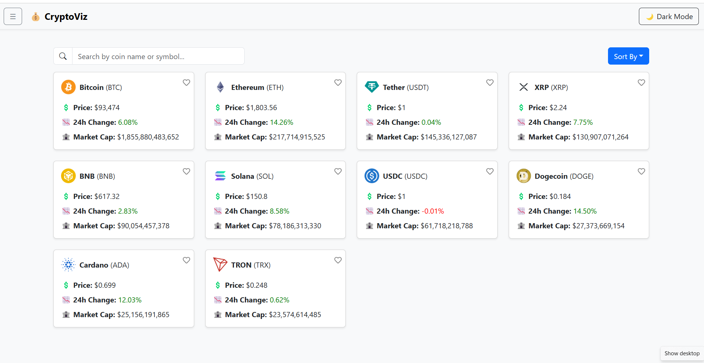
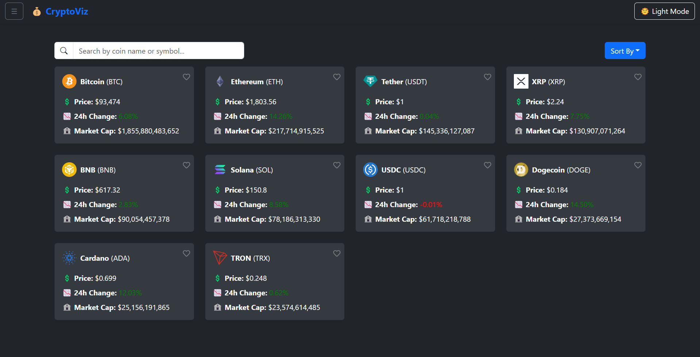
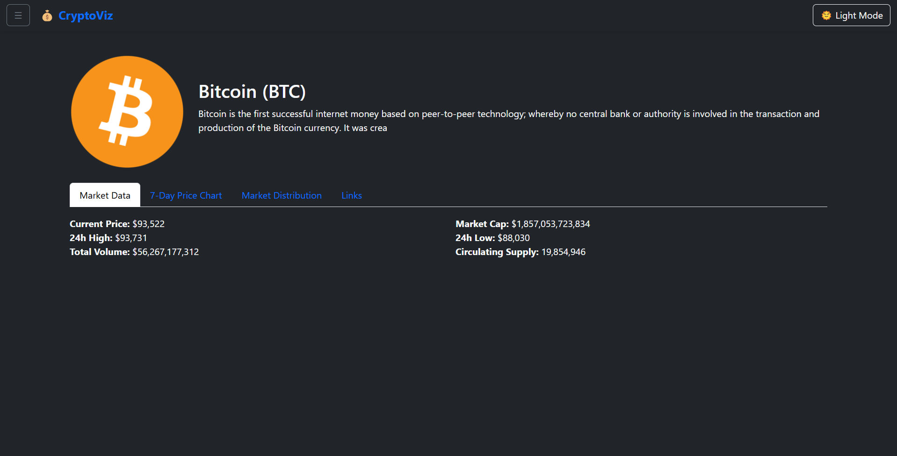
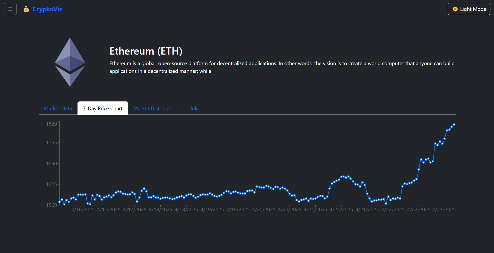
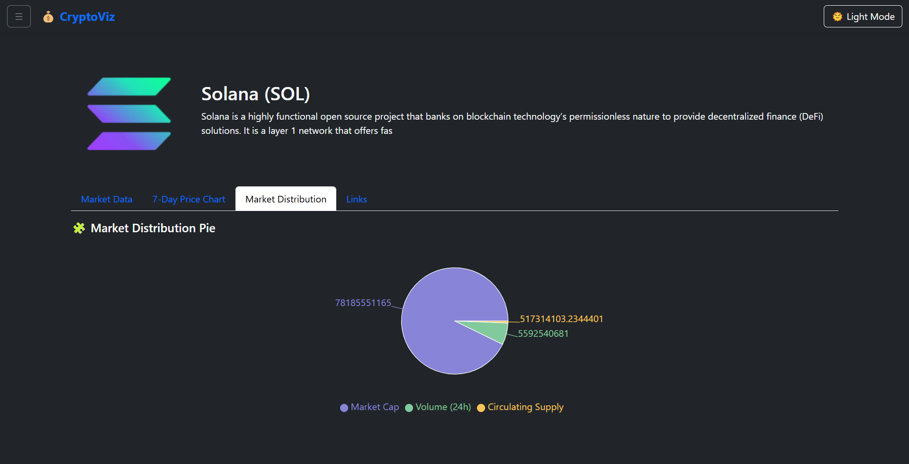
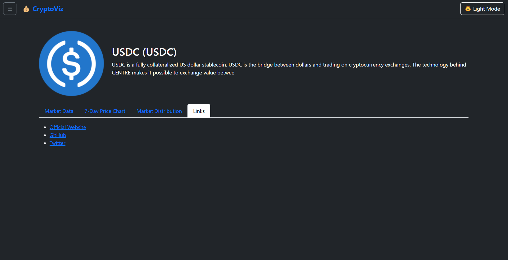

# 💰 CryptoViz - Real-time Cryptocurrency Dashboard

CryptoViz is a dynamic and responsive cryptocurrency dashboard built with ReactJS. It visualizes real-time data from the CoinGecko API and allows users to explore market trends, filter coins, and track their favorites.

## 🚀 Live Demo

🔗 [CryptoViz Direct Link](https://quiet-entremet-fed57a.netlify.app/)

---

## 📥 Installation Instructions

1. **Clone the repository:**
   ```bash
   git clone https://github.com/VishnuNakade/CryptoViz.git
   cd CryptoViz

2. **Install dependencies::**
    npm install

3. **Start the development server:**
    npm start

4. **Clone the repository:**
    Open your browser and go to http://localhost:3000

---

## 📸 Screenshots

1. **☀️ Dashboard View (Light Mode):**
    

2. **🌙 Dashboard View (Dark Mode):**
    

3. **📃 Market data:**
    

4. **📈 Price chart (last 7 days):**
    

5. **💸 Market Distribution:**
    

6. **🔗 Links to official site, GitHub, and Twitter:**
    

---

## ✨ Feature Highlights

🔄 Real-time Data — Live crypto stats powered by the CoinGecko API.

🔍 Search & Filter — Quickly search and filter coins by name or symbol.

📈 Sortable Data — Sort coins by market cap, price, or volume.

🖤 Favorites — Mark your favorite coins and access them instantly.

🌙 Dark/Light Mode — Toggle between elegant dark and clean light themes.

📱 Responsive UI — Mobile-first design that works beautifully on all devices.

🔗 Drill-down View — Click a coin to see detailed charts and data.

---

## 🛠️ Built With

⚛️ ReactJS

💅 Bootstrap + Custom CSS

📊 Chart.js / Recharts

🌐 CoinGecko API

🌙 Dark/Light Mode Toggle

💖 LocalStorage (for saving favorites)


---

## 📂 Folder Structure

CryptoViz/
├── public/
│   └── index.html
├── src/
│   ├── api/              # 📡 API calls (e.g., coingecko.js)
│   ├── components/       # 🧩 Reusable UI components (e.g., CoinCard, Header)
│   ├── pages/            # 📄 Page-level components (e.g., Home, CoinDetail)
│   ├── App.js            # 🌐 Main app component with routes
│   └── index.js          # 🏁 Entry point
└── README.md


